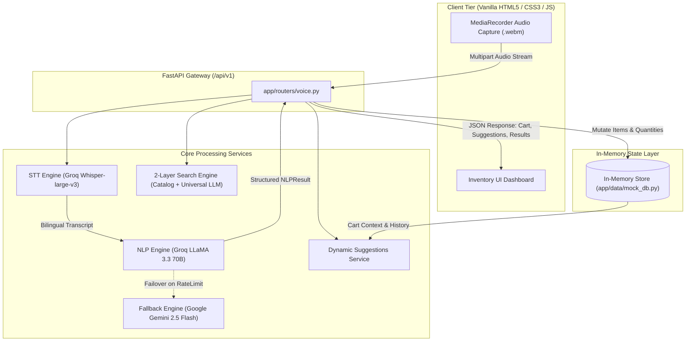

# 🎙️ Voice Command Shopping Assistant

[](https://www.python.org/)
[](https://fastapi.tiangolo.com/)
[](https://groq.com/)
[](https://ai.google.dev/)
[-F7DF1E.svg?logo=javascript&logoColor=black)](https://developer.mozilla.org/)
[](LICENSE)

An AI-powered, multilingual voice shopping assistant with real-time intent extraction, dynamic context-aware grocery suggestions, FMCG search & price filtering, and an inventory management dashboard.

## Engineering Approach

We designed a modular Clean Architecture using FastAPI and Pydantic to deliver a resilient, zero-latency voice commerce assistant. The pipeline processes spoken audio through Groq’s Whisper-large-v3 model with bilingual Hindi and English recognition. Transcriptions feed into a high-precision NLP extraction engine enforcing structured schema extraction. It accurately handles multi-item batch commands, implicit additions without explicit verbs, narrative lists, desi unit normalizations (such as dozen, quintal, and paav), and partial quantity reductions.

To ensure resilience against rate limits, an automated fallback hierarchy routes requests from Groq to Google Gemini. Catalog exploration leverages a two-layer search strategy: fast local indexing combined with universal LLM fallback to dynamically discover millions of off-catalog FMCG items. Smart suggestions dynamically adapt based on real-time cart state, historical reorders, and seasonal Indian harvest trends, preventing stale repetitions.

The user interface follows a zero-build vanilla stack (HTML5, CSS3, and JavaScript) to guarantee native browser execution without Node.js dependencies, providing an intuitive inventory management workspace with responsive visual waveforms and instant UI state hydration.

---

## 🏛️ System Architecture & NLP Pipeline



---

## 🌟 Key Features Implemented

### 1. Voice Command & Batch NLP Parsing
- **Multi-Item Batch Extraction:** Parses compound sentences into individual items with quantities and categories in a single voice command (e.g., *"10 kg moong dal, 20 kg rice, and 50 kg sugar"*).
- **Implicit Intent Inference:** Automatically classifies unprompted item names (e.g., *"Almond milk and bread"*) as `ADD_ITEM` with default quantities.
- **Desi Unit & Colloquial Handling:** Understands regional units (*"2 dazan aam"* → 24 pieces mango, *"1 quintal sugar"* → 100 kg, *"aadha kilo"* → 0.5 kg).
- **Partial & Full Removals:** Distinguishes between *"Remove mangoes"* (full deletion) and *"Remove 2 mangoes"* (partial quantity decrement).
- **Non-Duplicating Upsert:** Modify commands update existing item counters without creating duplicate entries.

### 2. Dual-Language Support (English & Hindi/Hinglish)
- Native bilingual transcription and comprehension via Whisper and LLM prompts.
- Translates Hindi items (*aam*, *doodh*, *chawal*, *aata*) into clean English catalog entities while retaining context.

### 3. Context-Aware Smart Suggestions
- **Cart-Aware Recommendations:** Evaluates what is currently in the cart to suggest natural complements (e.g., tea in cart triggers sugar and biscuit suggestions).
- **Seasonal Intelligence:** Recommends in-season items based on Indian agricultural cycles (Monsoon, Festival season, Winter harvest, Summer).
- **Dynamic Product Substitutes:** Offers smart health, dietary, and budget swaps (e.g., Oat/Almond Milk for Whole Milk).

### 4. Voice-Activated Search & Price Filtering
- **Center-Stage Search Grid:** Search queries display full product cards in the center workspace.
- **Two-Layer Lookup:** Searches local inventory first; queries universal LLM catalog fallback if items are off-catalog.
- **Multi-Dimensional Filters:** Filters by brand (*"Heinz"*), maximum price (*"under $5"* or *"below ₹200"*), and dietary tags (*"organic"*, *"vegan"*).

---

## 📁 Project Structure

```text
.
├── app/
│   ├── __init__.py
│   ├── main.py                 # FastAPI application entrypoint & static mounting
│   ├── config.py               # Environment configuration & API credentials
│   ├── models.py               # Pydantic schemas (NLPResult, CartItem, Suggestions)
│   ├── routers/
│   │   ├── __init__.py
│   │   └── voice.py            # API routes (/voice-command, /cart, /suggestions)
│   ├── services/
│   │   ├── __init__.py
│   │   ├── stt.py              # Groq Whisper-large-v3 speech-to-text service
│   │   ├── nlp_engine.py       # Dual-provider NLP parser (Groq + Gemini fallback)
│   │   ├── suggestions.py      # Cart-aware dynamic suggestions engine
│   │   └── catalog_search.py   # Two-layer catalog and LLM universal search
│   └── data/
│       ├── __init__.py
│       └── mock_db.py          # In-memory cart store & product catalog
├── static/
│   ├── index.html              # Responsive inventory UI layout & view views
│   ├── style.css               # Clean styling, CSS tokens, dark mode, animations
│   └── app.js                  # Audio recording, sidebar routing & reactive state
├── .env.example                # Sample environment configuration template
├── requirements.txt            # Minimal Python runtime dependencies
└── README.md                   # Technical documentation & usage guide
```

---

## 🚀 Local Setup & Quickstart

### Prerequisites
- Python 3.10 or higher
- Free API keys from [Groq Console](https://console.groq.com/) and [Google AI Studio](https://aistudio.google.com/)

### Installation Steps

1. **Clone the Repository:**
   ```bash
   git clone https://github.com/TaherBatterywala/Voice-Command-Shopping-Assistant.git
   cd "Voice-Command-Shopping-Assistant"
   ```

2. **Create and Activate Virtual Environment:**
   ```bash
   # Windows (PowerShell)
   python -m venv venv
   .\venv\Scripts\Activate.ps1

   # macOS / Linux
   python3 -m venv venv
   source venv/bin/activate
   ```

3. **Install Runtime Dependencies:**
   ```bash
   pip install -r requirements.txt
   ```

4. **Configure Environment Variables:**
   Create a `.env` file based on `.env.example`:
   ```bash
   cp .env.example .env
   ```
   Populate your credentials:
   ```env
   GROQ_API_KEY=your_groq_api_key_here
   GEMINI_API_KEY=your_gemini_api_key_here
   ```

5. **Start the Application:**
   ```bash
   uvicorn app.main:app --reload --port 8000
   ```

6. **Access the Application:**
   - Web Interface: [http://localhost:8000](http://localhost:8000)
   - Interactive Swagger API Docs: [http://localhost:8000/docs](http://localhost:8000/docs)

---

## 📡 API Endpoints Reference

| Method | Endpoint | Description |
|---|---|---|
| `POST` | `/api/v1/voice-command` | Processes live audio stream (`.webm`, `.wav`, `.mp3`) or `transcript_override` test bypass. Runs STT → NLP → Cart → Suggestions. |
| `GET` | `/api/v1/cart` | Retrieves the active in-memory shopping cart and item count. |
| `DELETE` | `/api/v1/cart` | Clears all items from the current shopping cart. |
| `DELETE` | `/api/v1/cart/{item_name}` | Silently deletes a single item from the cart (for UI card removal). |
| `GET` | `/api/v1/suggestions` | Retrieves initial smart suggestions on app hydration. |

---

## 🛡️ Submission & Compliance Standards

- **Zero Build Artifacts:** Strictly avoids Webpack, Vite, Babel, npm, or `node_modules`.
- **Pure Native Execution:** Backend runs purely on FastAPI; Frontend runs on standard browser APIs (`MediaRecorder`, Fetch, Vanilla DOM).
- **Minimal Dependencies:** Limited strictly to `fastapi`, `uvicorn`, `pydantic`, `groq`, `google-genai`, `python-dotenv`, and `python-multipart`.
